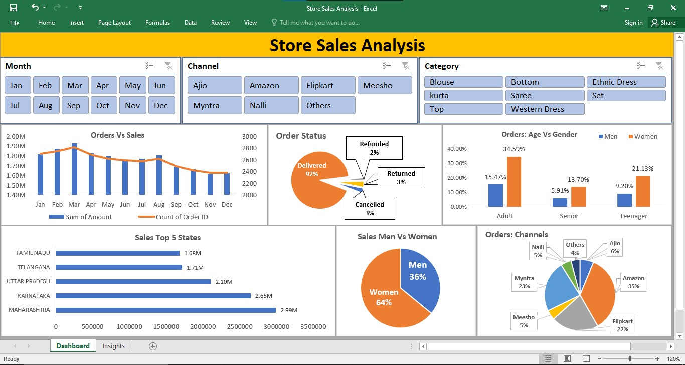

# Store-Sales-Analysis
## Project Overview
This project analyzes store sales data to evaluate overall sales performance, identify revenue trends, and compare store-wise results. The analysis is performed using Microsoft Excel, focusing on transforming raw sales data into meaningful business insights.

## Objective
* Analyze overall store sales performance
* Identify high- and low-performing stores
* Understand sales trends over time
* Generate insights to support better business decisions

## Dataset Description
The dataset contains sales transaction data at the store level.
### Key Columns Include:
* Store ID / Store Name
* Date
* Sales / Revenue
* Quantity Sold
* Product or Category (if applicable)
* The data is structured to allow comparison across stores and time periods.

## Tools & Techniques Used
* Microsoft Excel
* Data Cleaning & Formatting
* Pivot Tables & Pivot Charts
* Aggregation and summary analysis
* Basic data visualization

## Analysis Features
The analysis provides:
* Store-wise sales comparison
* Overall revenue distribution
* Identification of top-performing stores
* Trend analysis to observe sales patterns

## Key Insights
* A small number of stores contribute a large share of total sales.
* Certain stores consistently outperform others, indicating location or demand advantages.
* Sales patterns suggest opportunities for improving underperforming stores.

## Dashboard Preview

## Conclusion
This project demonstrates the use of Excel for analyzing store-level sales data and extracting actionable insights. The analysis helps identify performance gaps and supports data-driven decision-making for retail operations.
